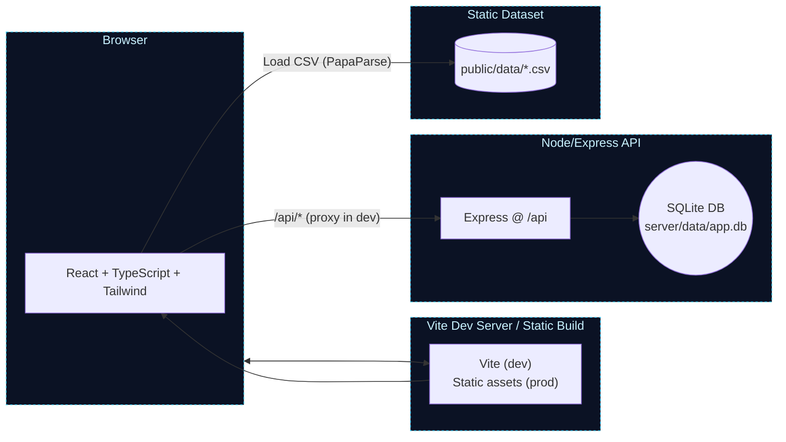
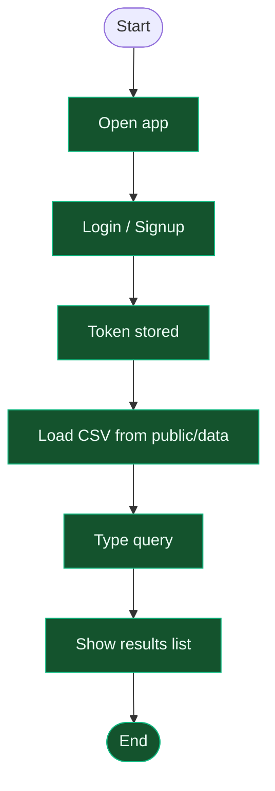

# Project-I : ThreadQuest
## Structure:
- [Github Repo Tree Visualize](https://readmecodegen.vercel.app/file-tree/file-tree-generator/github-file-tree-visualizer)
```
Project-I/
├── Datasets/
│   ├── Divide Original/
│   │   ├── original_part_1.csv
│   │   ├── original_part_2.csv
│   │   ├── original_part_3.csv
│   │   ├── original_part_4.csv
│   │   └── original_part_5.csv
│   ├── Preprocess Sets/
│   │   ├── preprocessed_part_1.csv
│   │   ├── preprocessed_part_2.csv
│   │   ├── preprocessed_part_3.csv
│   │   ├── preprocessed_part_4.csv
│   │   └── preprocessed_part_5.csv
│   ├── Training Sets/
│   │   ├── output_part_1.csv
│   │   ├── output_part_2.csv
│   │   ├── output_part_2_Jumbo.csv
│   │   ├── output_part_3.csv
│   │   ├── output_part_4.csv
│   │   └── output_part_5.csv
│   ├── original_questions_answers_dataset.csv
│   └── preprocessed_questions_answers_dataset.csv
├── Modelling/
│   ├── DistillBert-Approach2.ipynb
│   ├── Hybrid_2.ipynb
│   ├── Hybrid_Implement.ipynb
│   ├── Hybrid_Model_1.ipynb
│   ├── MobileBert-2-Electra.ipynb
│   ├── Mobile_Electra_Albert.ipynb
│   ├── Roberta-Approach-2.ipynb
│   ├── Roberta_Model-Approach2.ipynb
│   ├── Top2Vec_Model.ipynb
│   ├── bert-variants.ipynb
│   ├── model-comparison.md
│   └── top2vec-Approach2.ipynb
├── Project Models List.md
├── README.md
└── topic_modeling_models_with_metrics.md
```

## Dataset Link - StackOverflow
- [Link - 1](https://stackexchange.com/digests)
- [Link - 2](https://langdev.stackexchange.com/)
- [Link - 3](https://data.stackexchange.com/)
- [Link - 4](https://data.stackexchange.com/datascience/queries?order_by=everything)
- [Link - 5](https://data.stackexchange.com/datascience/query/edit/1909796#resultSets)
- [Perplexity - Link](https://www.perplexity.ai/search/apply-this-preprocessing-steps-nQmQttEzRJiCNuOZlSk2lA)

# Text Preprocessing Steps:
1. **Lowercasing:**  
   Converts all text to lowercase to ensure uniformity (e.g., "Apple" and "apple" are treated the same).
2. **Removing Punctuation:**  
   Eliminates punctuation marks such as commas, periods, exclamation points, etc., unless needed for analysis.
3. **Removing Stop Words:**  
   Removes common words that carry little semantic meaning (e.g., "the", "is", "a").
4. **Tokenization:**  
   Splits text into individual words or tokens.
5. **Stemming:**  
   Reduces words to their root form (e.g., "running" → "run").
6. **Lemmatization:**  
   Reduces words to their base or dictionary form, considering context (e.g., "better" → "good").
7. **Removing Numbers:**  
   Removes numerical values that may not be relevant for certain analyses.
8. **Removing URLs and HTML Tags:**  
   Strips out website links and HTML code fragments.
9. **Handling Special Characters and Emojis:**  
   Removes or converts special characters and emojis into a usable format.
10. **Handling Chat Words, Slang, and Typos:**  
    Expands abbreviations, corrects common misspellings, and normalizes informal language.


## Architecture
# Project workflow and architecture diagrams

This document illustrates the end-to-end workflow for the app, including the frontend, backend, authentication, dataset search, and theming.

## System architecture



Notes
- In development, Vite proxies requests from `/api/*` to the Express server (e.g., http://localhost:3001).
- In production, the React app is built as static files; the API runs separately.

## High-level project workflow (vertical)

This is a simple top-down view similar to common “project workflow” visuals.


