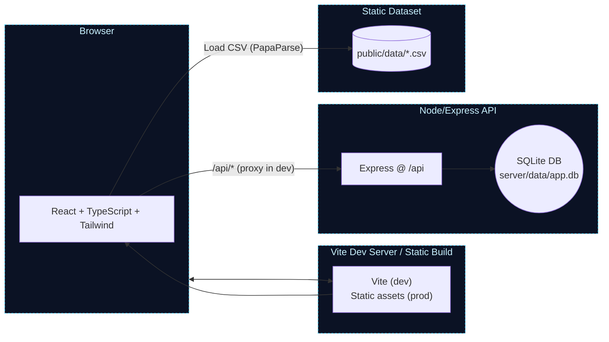
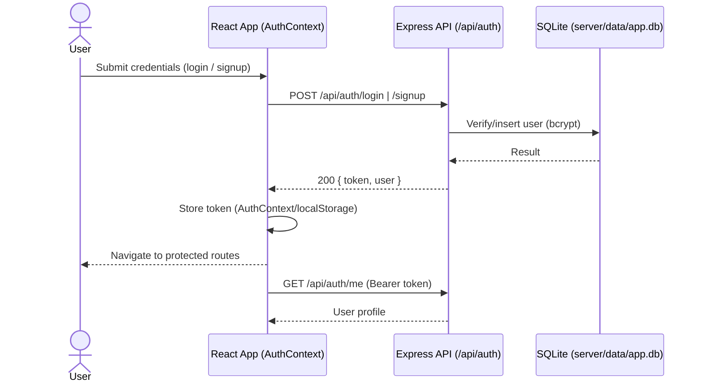
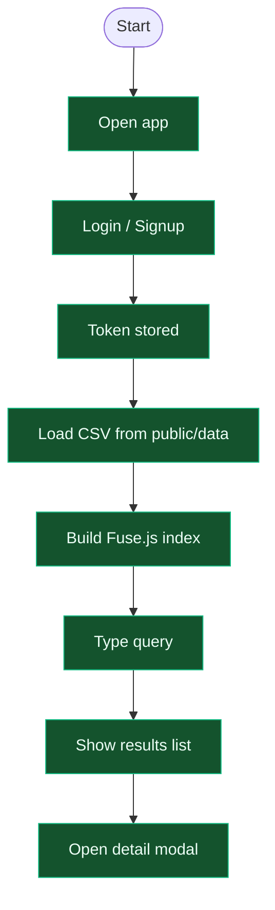

# Project workflow and architecture diagrams

This document illustrates the end-to-end workflow for the app, including the frontend, backend, authentication, dataset search, and theming.

## System architecture



Notes
- In development, Vite proxies requests from `/api/*` to the Express server (e.g., http://localhost:3001).
- In production, the React app is built as static files; the API runs separately.

## Authentication flow



## Dataset search flow

```mermaid
flowchart TD
  CSV[(CSV in public/data)] --> PARSE["PapaParse loader<br/>(useDataset hook)"]
  PARSE --> INDEX[Fuse.js index]
  INPUT[Search input] --> INDEX
  INDEX --> RESULTS[ResultsList]
  RESULTS --> DETAIL[DetailDrawer (centered modal)]

  classDef node fill:#0b1224,stroke:#8b5cf6,stroke-width:1px,color:#e9d5ff;
  class CSV,PARSE,INDEX,INPUT,RESULTS,DETAIL node;
```

## Theming flow (light/dark)

```mermaid
flowchart LR
  TOGGLE[ThemeToggle (icon)] --> CTX[ThemeContext]
  CTX --> HTML[html.classList: dark]
  HTML --> TAILWIND[Tailwind dark: class mode]
  TAILWIND --> UI[Components (App, Footer, Results, DetailDrawer)]

  classDef node fill:#07151b,stroke:#22d3ee,stroke-width:1px,color:#cffafe;
  class TOGGLE,CTX,HTML,TAILWIND,UI node;
```

---

Want exportable images? See the README section for optional mermaid-cli commands to render SVG/PNG.

## High-level project workflow (vertical)

This is a simple top-down view similar to common “project workflow” visuals.



